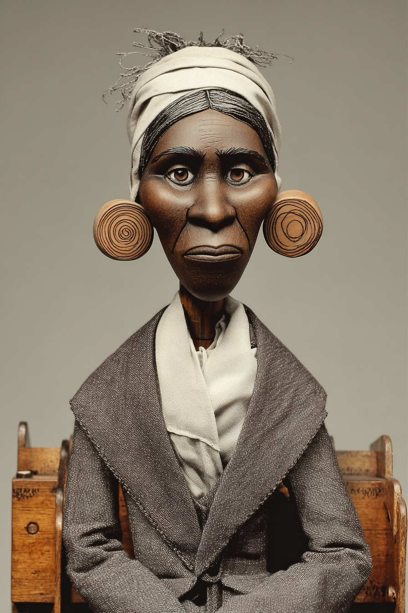
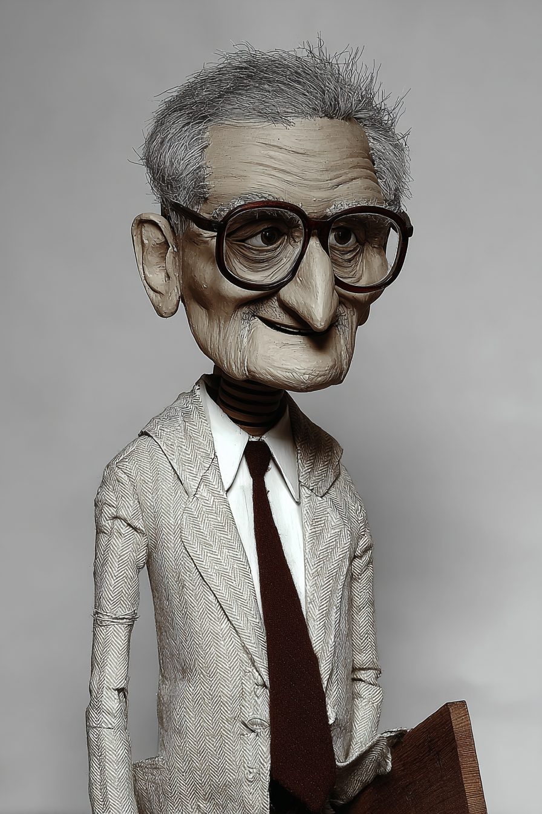

# Business Ethics — Wayback Sections

> Extracted from `chapters/`. Each entry corresponds to one chapter file.
> Sections are instructor-authored. Missing sections show a placeholder only.
> Do not edit this file directly — edit the source chapter file, then re-run extraction.

---

## Chapter 00: Business Ethics: with LLMs
*Source: `chapters/00-frontmatter.md`*

> **Section not yet authored.** No `## AI Wayback Machine` block found in this chapter file.
> To add this section, edit the source chapter file directly.

---

## Chapter 00: Introduction
*Source: `chapters/00-introduction.md`*

> **Section not yet authored.** No `## AI Wayback Machine` block found in this chapter file.
> To add this section, edit the source chapter file directly.

---

## Chapter 01: Chapter 1 — Why Ethics Matter
*Source: `chapters/01-why-ethics-matter.md`*

##  AI Wayback Machine
The ideas in this chapter didn't appear from nowhere. **Mary Parker Follett** was an early-20th-century American organizational theorist who argued — decades before "business ethics" was a field — that conflict in firms should be resolved by *integration*, not domination or compromise. Peter Drucker called her the "prophet of management."

**Run this:**

```
Who was Mary Parker Follett, and how does her work on conflict integration and organizational ethics connect to why ethics matter in business, as we covered in this chapter? Keep it to three paragraphs. End with the single most surprising thing about her career or ideas.
```

→ Search **"Mary Parker Follett"** on Wikipedia.

**Now make the prompt better.** Try one of these:

- Ask it to apply Follett's "integration" approach to one current business ethics dilemma — what does it suggest doing?
- Ask it about why Follett's work was forgotten for decades after her death — and how it was revived.

What changes? What gets better? What gets worse?

---

## Chapter 02: Chapter 2 — Ethics from Antiquity to the Present
*Source: `chapters/02-ethics-from-antiquity-to-the-present.md`*

##  AI Wayback Machine
The ideas in this chapter didn't appear from nowhere. **Hsün Tzu** (Xunzi) was a 3rd-century BCE Chinese Confucian philosopher who argued that human nature is intrinsically bad and must be shaped by ritual and ethical institutions — a view very different from the prevailing Confucian "human nature is good" school of Mencius. The debate is the foundation of two thousand years of East Asian ethics.

**Run this:**

```
Who was Hsün Tzu, and how does his philosophy of ethics, ritual, and human nature connect to the history of ethics we covered in this chapter? Keep it to three paragraphs. End with the single most surprising thing about his career or ideas.
```

→ Search **"Xunzi (philosopher)"** on Wikipedia.

**Now make the prompt better.** Try one of these:

- Ask it to compare Xunzi's "nature is bad" view with Mencius's "nature is good" view — and what each says about business ethics today.
- Ask it about how Xunzi's institutional emphasis maps onto modern corporate compliance programs.

What changes? What gets better? What gets worse?

---

## Chapter 03: Chapter 3 — Defining and Prioritizing Stakeholders
*Source: `chapters/03-defining-and-prioritizing-stakeholders.md`*

##  AI Wayback Machine
The ideas in this chapter didn't appear from nowhere. **R. Edward Freeman** published *Strategic Management: A Stakeholder Approach* in 1984 — the book that established stakeholder theory as a serious alternative to Friedman's shareholder primacy. The framework you used to identify and prioritize stakeholders in this chapter is essentially his.

**Run this:**

```
Who is R. Edward Freeman, and how does his stakeholder theory connect to the stakeholder definition and prioritization framework we covered in this chapter? Keep it to three paragraphs. End with the single most surprising thing about his career or ideas.
```

→ Search **"R. Edward Freeman"** on Wikipedia.

**Now make the prompt better.** Try one of these:

- Ask it to apply Freeman's framework to one specific company's stakeholders today — who counts, who doesn't, who's contested?
- Ask it to compare Freeman's stakeholder approach with Milton Friedman's "the only social responsibility is to shareholders" thesis.

What changes? What gets better? What gets worse?

---

## Chapter 04: Chapter 4 — Three Special Stakeholders: Society, the Environment, and Government
*Source: `chapters/04-three-special-stakeholders-society-the-environment-and-government.md`*

##  AI Wayback Machine
The ideas in this chapter didn't appear from nowhere. **Donella Meadows** was the lead author of *The Limits to Growth* in 1972 — the systems-dynamics modeling study that put environmental constraint at the center of how serious people thought about long-term business and government policy. Her work made stakeholders out of ecosystems.

**Run this:**

```
Who was Donella Meadows, and how does her systems-dynamics environmental work connect to the special-stakeholder categories — society, environment, government — we covered in this chapter? Keep it to three paragraphs. End with the single most surprising thing about her career or ideas.
```

→ Search **"Donella Meadows"** on Wikipedia.

**Now make the prompt better.** Try one of these:

- Ask it to walk through one of the original 1972 Limits to Growth scenarios and what it predicted versus what we've observed.
- Ask it about Meadows's "leverage points" essay — where small changes in a system can produce large effects.

What changes? What gets better? What gets worse?

---

## Chapter 05: Chapter 5 — The Impact of Culture and Time on Business Ethics
*Source: `chapters/05-the-impact-of-culture-and-time-on-business-ethics.md`*

##  AI Wayback Machine
The ideas in this chapter didn't appear from nowhere. **Geert Hofstede** spent the 1970s studying IBM employees across 50 countries — producing the cultural-dimensions framework (power distance, individualism, uncertainty avoidance) that taught a generation of multinational managers to recognize that their assumptions weren't universal.

**Run this:**

```
Who was Geert Hofstede, and how do his cultural dimensions connect to the impact of culture on business ethics we covered in this chapter? Keep it to three paragraphs. End with the single most surprising thing about his career or ideas.
```

→ Search **"Geert Hofstede"** on Wikipedia.

**Now make the prompt better.** Try one of these:

- Ask it to compare Hofstede's dimensions for two countries and predict where their business-ethics norms would diverge.
- Ask it to discuss the major criticisms of Hofstede's framework — when does it oversimplify culture?

What changes? What gets better? What gets worse?

---

## Chapter 06: Chapter 6 — What Employers Owe Employees
*Source: `chapters/06-what-employers-owe-employees.md`*

##  AI Wayback Machine
The ideas in this chapter didn't appear from nowhere. **Crystal Eastman** drafted the first US workers' compensation law in 1909 — after her own investigation into workplace deaths in Pittsburgh steel mills proved that "industrial accidents" were predictable and preventable. She co-founded the ACLU.

**Run this:**

```
Who was Crystal Eastman, and how does her work on workers' compensation and labor protections connect to what employers owe employees, as we covered in this chapter? Keep it to three paragraphs. End with the single most surprising thing about her career or ideas.
```

→ Search **"Crystal Eastman"** on Wikipedia.

**Now make the prompt better.** Try one of these:

- Ask it to walk through Eastman's 1909 Pittsburgh Survey methodology — how did she document workplace deaths that previously went unrecorded?
- Ask it about Eastman's later role drafting the Equal Rights Amendment and co-founding the ACLU.

What changes? What gets better? What gets worse?

---

## Chapter 07: Chapter 7 — What Employees Owe Employers
*Source: `chapters/07-what-employees-owe-employers.md`*

##  AI Wayback Machine
The ideas in this chapter didn't appear from nowhere. **Sherron Watkins** was the Enron vice president whose internal memo to Ken Lay in 2001 warned that the company would "implode in a wave of accounting scandals." Her letter became the textbook example of an employee navigating the duty of loyalty versus the duty of disclosure.

**Run this:**

```
Who is Sherron Watkins, and how does her Enron whistleblowing connect to what employees owe employers — and what they owe the public — as we covered in this chapter? Keep it to three paragraphs. End with the single most surprising thing about her career or ideas.
```

→ Search **"Sherron Watkins"** on Wikipedia.

**Now make the prompt better.** Try one of these:

- Ask it to walk through Watkins's 2001 memo to Lay — what specifically did she allege, and how did Enron respond?
- Ask it to compare Watkins's case with one more recent whistleblower (Frances Haugen, Edward Snowden) — what carries over, what differs?

What changes? What gets better? What gets worse?

---

## Chapter 08: Chapter 8 — Recognizing and Respecting the Rights of All
*Source: `chapters/08-recognizing-and-respecting-the-rights-of-all.md`*

##  AI Wayback Machine
The ideas in this chapter didn't appear from nowhere. **Sojourner Truth** delivered her "Ain't I a Woman?" speech at the 1851 Women's Rights Convention in Ohio — extending the language of rights and dignity to both Black people and women in a country that excluded both. Her insistence on intersecting rights claims still shapes modern business-ethics frameworks on inclusion.



*Puppet Art by [Nik Bear Brown](https://www.nikbearbrown.com/).*

**Run this:**

```
Who was Sojourner Truth, and how does her advocacy for intersecting rights connect to the recognition and respect of rights we covered in this chapter? Keep it to three paragraphs. End with the single most surprising thing about her career or ideas.
```

→ Search **"Sojourner Truth"** on Wikipedia.

**Now make the prompt better.** Try one of these:

- Ask it to compare the contested versions of the "Ain't I a Woman?" speech — what we know about what Truth actually said.
- Ask it about Truth's lawsuit against a white man who had illegally sold her son into slavery in Alabama — one of the first such successful suits by a Black woman.

What changes? What gets better? What gets worse?

---

## Chapter 09: Chapter 9 — Professions Under the Microscope
*Source: `chapters/09-professions-under-the-microscope.md`*

##  AI Wayback Machine
The ideas in this chapter didn't appear from nowhere. **Abraham Flexner** wrote the 1910 report that reshaped American medical education — closing roughly half of US medical schools, including most that admitted women, Black students, and immigrants. The report set the template for the modern professionalized field — for better and worse.

**Run this:**

```
Who was Abraham Flexner, and how does the 1910 Flexner Report connect to how professions and their ethics are structured today, as we covered in this chapter? Keep it to three paragraphs. End with the single most surprising thing about his career or ideas.
```

→ Search **"Flexner Report"** on Wikipedia.

**Now make the prompt better.** Try one of these:

- Ask it to enumerate the specific schools the Flexner Report closed — and the demographic impact of those closures on the profession.
- Ask it to compare the Flexner Report's effect on medicine with the more recent debates over professional licensing reform in law and accounting.

What changes? What gets better? What gets worse?

---

## Chapter 10: Chapter 10 — Changing Work Environments and Future Trends
*Source: `chapters/10-changing-work-environments-and-future-trends.md`*

##  AI Wayback Machine
The ideas in this chapter didn't appear from nowhere. **Shoshana Zuboff** wrote *In the Age of the Smart Machine* in 1988 — the first serious account of how digital surveillance would transform the workplace, decades before "surveillance capitalism" became a household phrase. Her later work made the case explicit.

**Run this:**

```
Who is Shoshana Zuboff, and how does her work on workplace technology and surveillance capitalism connect to the changing work environments we covered in this chapter? Keep it to three paragraphs. End with the single most surprising thing about her career or ideas.
```

→ Search **"Shoshana Zuboff"** on Wikipedia.

**Now make the prompt better.** Try one of these:

- Ask it to apply Zuboff's framework to one specific 2020s workplace technology (employee monitoring, productivity AI, biometric scanning) — what does it predict?
- Ask it to discuss the criticisms of Zuboff's "surveillance capitalism" thesis from technology scholars.

What changes? What gets better? What gets worse?

---

## Chapter 11: Chapter 11 — Epilogue: Why Ethics Still Matter
*Source: `chapters/11-epilogue-why-ethics-still-matter.md`*

##  AI Wayback Machine
The ideas in this chapter didn't appear from nowhere. **Amartya Sen** built the "capability approach" to ethics and economics over four decades — arguing that human well-being should be measured by what people are capable of doing and being, not just what they consume. He won the 1998 Nobel Prize in Economics and reshaped both development economics and business ethics.



*Puppet Art by [Nik Bear Brown](https://www.nikbearbrown.com/).*

**Run this:**

```
Who is Amartya Sen, and how does his capability approach connect to why ethics still matters in business, as the epilogue of this book argues? Keep it to three paragraphs. End with the single most surprising thing about his career or ideas.
```

→ Search **"Amartya Sen"** on Wikipedia.

**Now make the prompt better.** Try one of these:

- Ask it to apply Sen's capability framework to one specific business decision — what new ethical considerations does it raise?
- Ask it to compare Sen's capability approach with utilitarian and rights-based ethical frameworks.

What changes? What gets better? What gets worse?

---

## Chapter 99: 99 Back Matter
*Source: `chapters/99-back-matter.md`*

> **Section not yet authored.** No `## AI Wayback Machine` block found in this chapter file.
> To add this section, edit the source chapter file directly.

---
